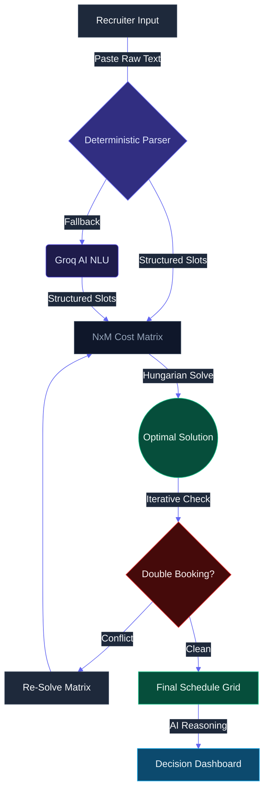

<p align="center">
  
</p>

<h1 align="center">⚡ SlotMaxxer</h1>

<p align="center">
  <strong>The Recruiter-Grade Optimization Engine turns Scheduling Chaos into Pure Logic.</strong>
</p>

<p align="center">
  
  
  
</p>

<br />

---

### 📑 Table of Contents

1. [💡 The Workflow Nightmare](#-the-workflow-nightmare)
2. [🔥 Feature Highlights](#-feature-highlights)
3. [🛣️ How It Works](#️-how-it-works)
4. [🛡️ Tech Stack](#️-tech-stack)
5. [🔧 Configuration Weights](#-configuration-weights)
6. [🧪 Testing & Quality](#-testing--quality)

---

### 💡 The Workflow Nightmare

Recruiters spend **~3 hours weekly** manually cross-referencing natural language emails like *"Free Tue-Thu but prefer afternoons"* against panel availability. This leads to burnout, double-bookings, and "suboptimal" slots that frustrate busy interviewers.

**SlotMaxxer** solves this by combining a globally optimal **Hungarian Assignment Algorithm** with **Deterministic & AI-Fallback Natural Language Understanding**.

---

### 🔥 Feature Highlights

- **🎯 Deterministic Parsing**: 90% of availability is parsed via high-performance regex rules. Groq/Llama-3 acts as an intelligent fallback for complex natural language, ensuring speed and sub-second reliability.
- **🏛️ Hungarian Optimization**: Uses `scipy.optimize` to solve the assignment problem globally. Guarantees the absolute maximum "Total Quality Score" across the entire panel (no more "first-come, first-served" bias).
- **📉 Intelligent Scarcity**: Automatically protects busy executives and scarce interviewers by prioritizing their limited slots for the most critical candidates first.
- **🔄 Live Visual Diff**: Cancel an interview? See a side-by-side comparison of how the system re-optimizes the entire grid in real-time.
- **📧 Pro-Grade Communication**: Automatic generation of personalized, reasoning-focused interview invitations with one-click copy.
- **📊 Timeline Strategy**: Horizontally scrolling density maps that reveal scheduling hotspots before they become bottlenecks.

---

### 🛣️ How It Works



---

### 🚀 Quick Start

#### 1. Direct Install (Requires [uv](https://github.com/astral-sh/uv))
```bash
# Clone the repository
git clone https://github.com/your-username/slotmaxxer.git
cd slotmaxxer

# Add your credentials
echo "GROQ_API_KEY=your_key_here" > .env

# Fire up the engine
uv run uvicorn api:app --port 8000 --reload
```

#### 2. Launch
Head over to **[`http://localhost:8000`](http://localhost:8000)** and start "maxxing" your slots.

---

### 🛡️ Tech Stack

SlotMaxxer is built for production-grade reliability:

- **Backend**: [FastAPI](https://fastapi.tiagolo.org/) (High-performance API Gateway)
- **Engine**: [NumPy](https://numpy.org/) + [SciPy](https://scipy.org/) (Hungarian Linear Sum Assignment)
- **Intelligence**: [Groq](https://groq.com/) + Llama-3-70b (Sub-second LLM inference fallback)
- **Frontend**: Tailwind CSS + FontAwesome (Modern "Glass" Aesthetic)

---

### 🔧 Configuration Weights

The "Quality Score" ensures **Global Optimization** while preserving recruiter intent:

| Factor | Weight | Goal |
| :--- | :---: | :--- |
| **Candidate Preference** | +1000 | Ensure candidate satisfaction & higher close rates. |
| **Interviewer Priority** | +500 | Respect busy panelist calendars. |
| **Peak-Time Bonus** | +500 | Prioritize 10 AM - 2 PM (Peak productivity). |
| **Medium-Time Bonus** | +300 | Prioritize 9 AM - 4 PM. |
| **Scarcity Multiplier** | 1000/N | Protect rare interviewers (N = total base slots). |

---

### 🧪 Testing & Quality

Verify the engine's reliability across 50+ comprehensive test scenarios, including the new Hungarian benchmarks:

```bash
# Run all tests (Hungarian, Edge Cases, Stress, Security, Performance)
uv run python run_tests.py
```

All test logic reside in the `/tests` directory, with automated reports generated in `/tests/reports`.

---

### 📄 License

This project is licensed under the **MIT License**. Use it to optimize your company's efficiency or build the next big recruitment tool.

<p align="center">
  Built with ⚡ by <strong>RedLordezh7Venom</strong>
</p>
